# Guessr Programs (MagicBlock / Solana ER)

This folder contains:

- Rust on-chain program (single Guessr program: lobby + duel + ranked modules)
- TypeScript scripts for initialization and flow tests
- Shell scripts for ordered deploy flow

## 📸 App Sneak Peek

### Booking Flow

<div align="center">
  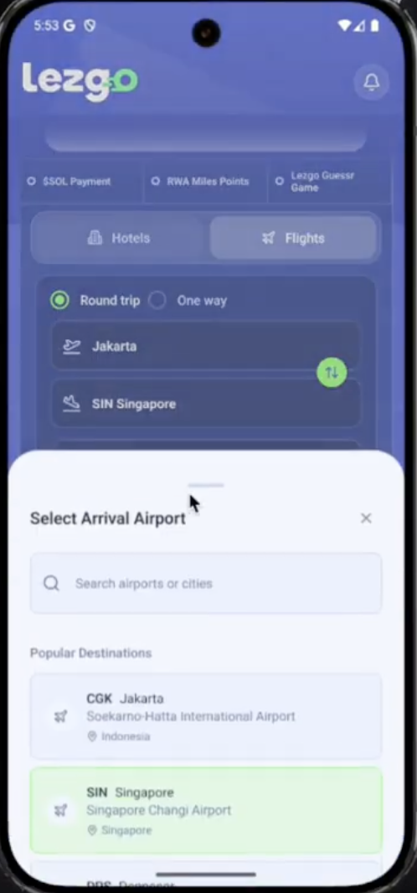
  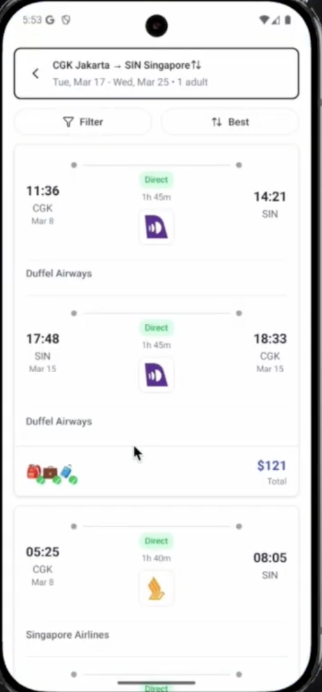
  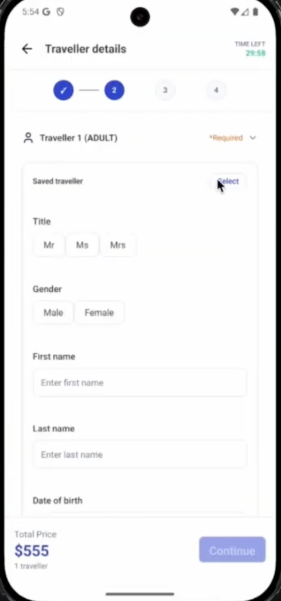
  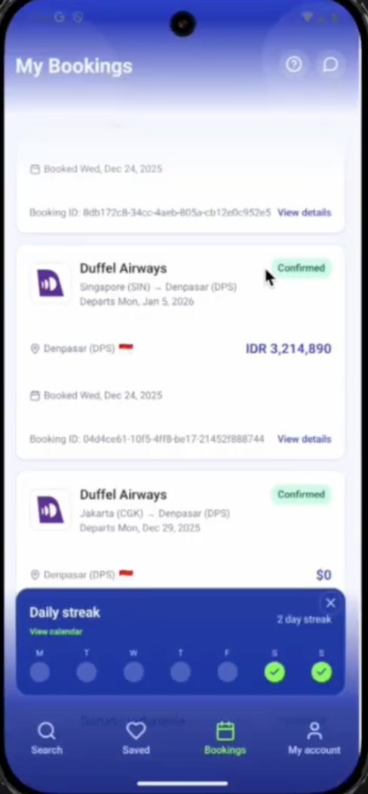
  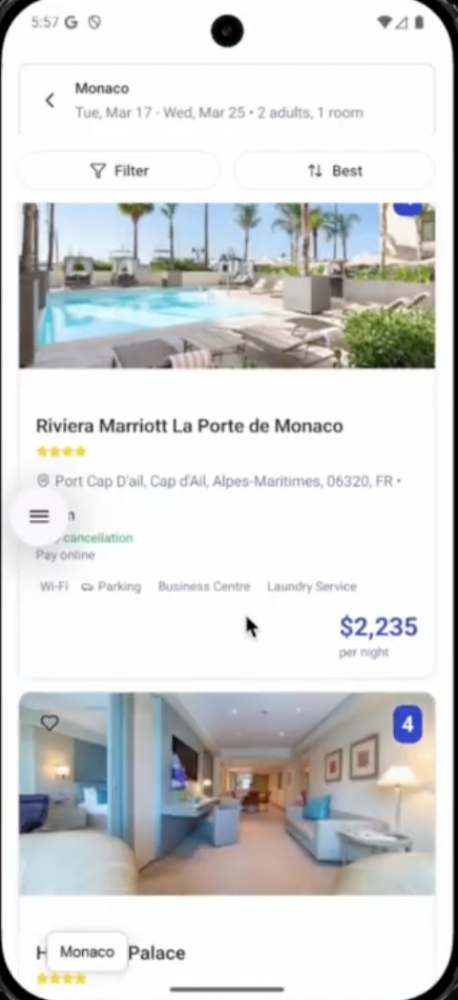
  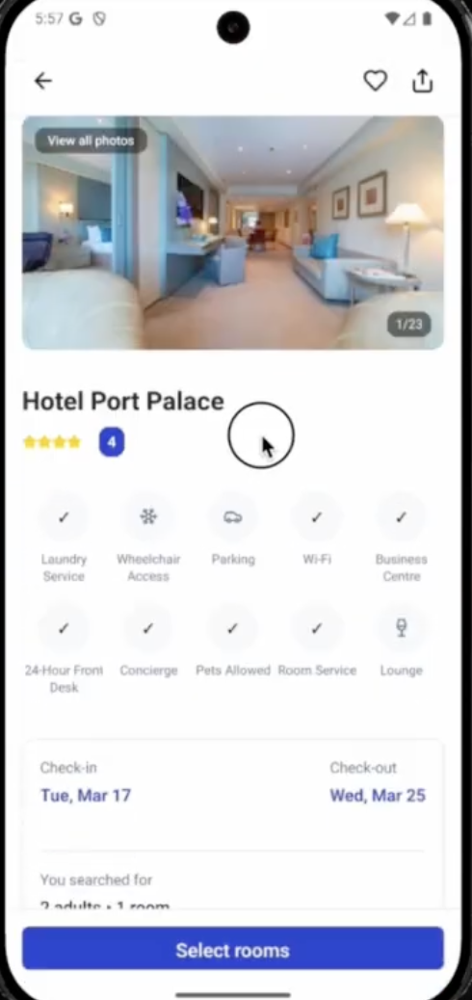
  <p><em>Booking flow screenshots (portrait orientation)</em></p>
</div>

### Gameplay Flow

<div align="center">
  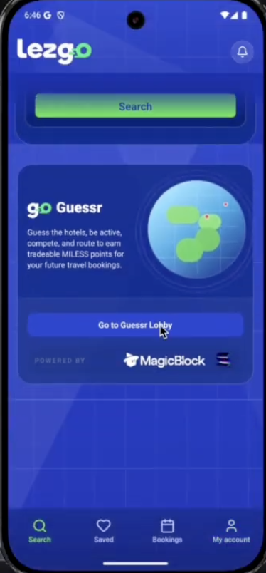
  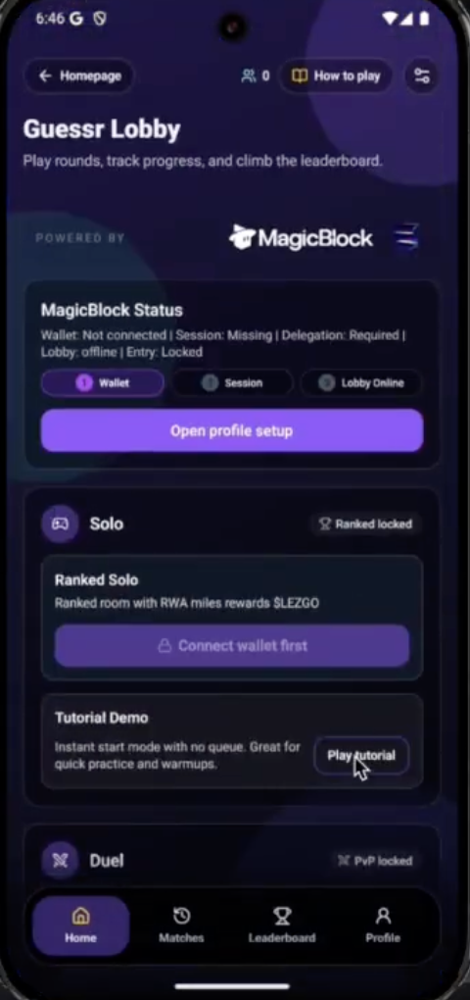
  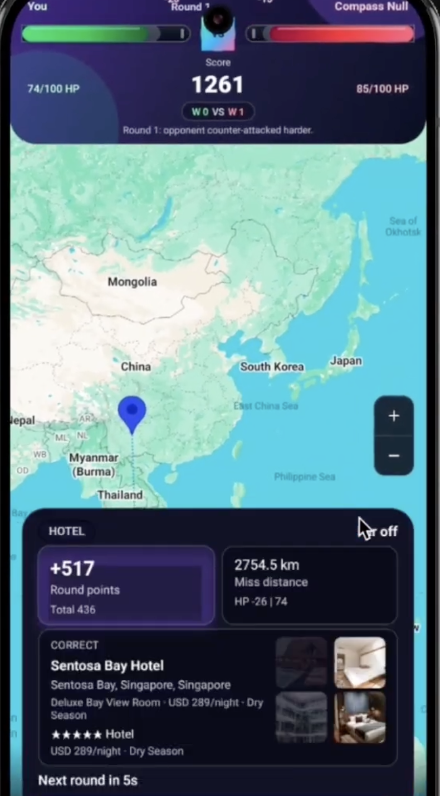
  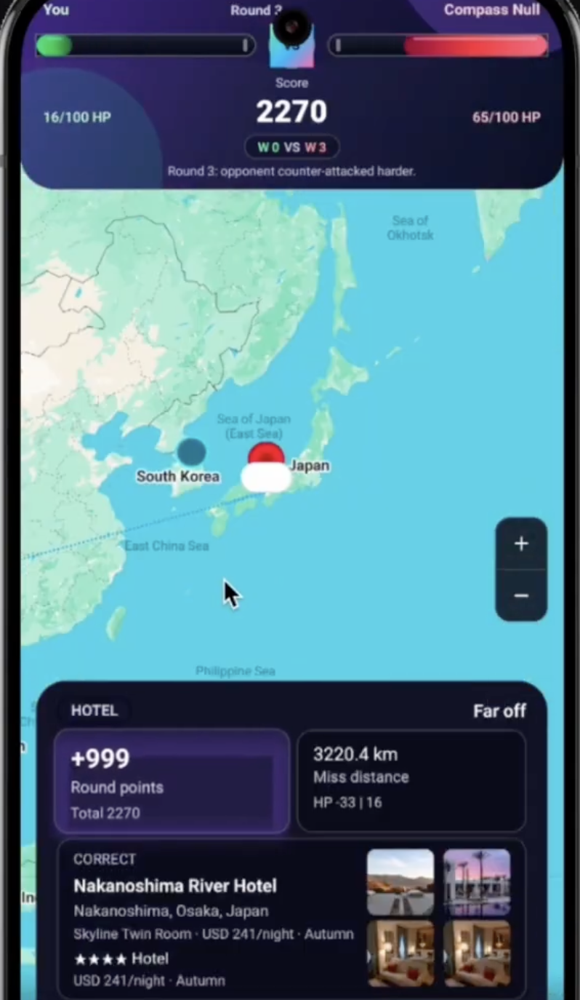
  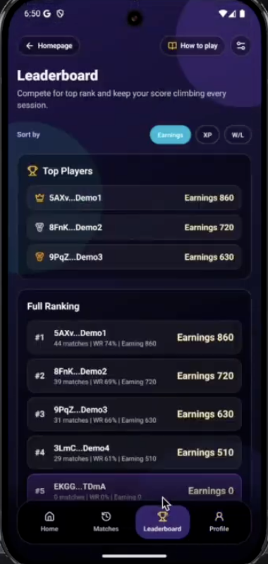
  <p><em>Guessr gameplay flow (portrait orientation)</em></p>
</div>

### Demo Video

<div align="center">
  <a href="https://www.youtube.com/watch?v=W8mK0BOtXpw" target="_blank">
    
  </a>
  <p><em>Click to watch the demo on YouTube</em></p>
</div>

**Download the app:** `https://drive.google.com/drive/folders/1Quz8pbWoJ02yKnW53zsGkfWWLcLVX3x-?usp=drive_link`

---

## Prerequisites

1. Install Solana CLI + `spl-token`
2. Install Rust + `cargo build-sbf`
3. Use a payer keypair with devnet SOL
4. From project root, install JS deps (`bun install`)

## Environment

Use these env vars before running scripts:

```bash
export SOLANA_RPC_URL="https://api.devnet.solana.com"
export SOLANA_PAYER_KEYPAIR="$HOME/.config/solana/id.json"
```

Recommended: keep script-specific config in a local file:

```bash
cp @programs/scripts/.env.programs.example @programs/scripts/.env.programs
# edit values, especially USER_A_KEYPAIR / USER_B_KEYPAIR / USER_C_KEYPAIR
set -a
source @programs/scripts/.env.programs
set +a
```

For script-driven flow, add:

```bash
export MULTIPLAYER_HEARTBEAT_TTL_SEC=300
export REWARD_MULTIPLIER=140
export PENALTY_DIVISOR=160
export PENALTY_THRESHOLD=420
```

## Numbered Full Flow

1. Create reward SPL mint + treasury token account

```bash
./@programs/scripts/01_create_reward_mint.sh
```

Copy/export the printed:
`REWARD_MINT`, `REWARD_TREASURY_TOKEN_ACCOUNT`.

2. Deploy shared Guessr program (multiplayer + ranked modules)

```bash
./@programs/scripts/02_deploy_multiplayer_program.sh
```

Copy/export the printed:
`GUESSR_PROGRAM_ID`.

3. Initialize full Guessr system (lobby + ranked config in one tx)

```bash
bun run @programs/scripts/03_initialize_guessr_system.ts
```

4. Delegate required Guessr PDAs to ER validators

```bash
bun run @programs/scripts/04_delegate_guessr_state.ts
```

The script sends all delegation instructions in one transaction when it fits.
If transaction size is exceeded, it automatically splits into multiple transactions until all required existing PDAs are delegated.

Optional env inputs for dynamic PDAs:

```bash
export DELEGATE_PLAYER_WALLETS="<wallet1>,<wallet2>"
export DELEGATE_DUEL_ROOM_IDS="<room-id-or-room-address>,<room-id-or-room-address>"
export DELEGATE_RANKED_CHALLENGES="<challenge-id-1>,<challenge-id-2>"
export DELEGATE_REWARD_CLAIMS="<wallet>:<match-id>:0,<wallet>:<match-id>:1"
```

5. Commit delegated PDAs from ER back to base layer

```bash
bun run @programs/scripts/05_commit_guessr_state.ts
```

This script uses the same `DELEGATE_*` input envs as step 4 to discover dynamic PDAs.
It commits lobby/ranked config plus all discovered existing PDAs in one transaction when possible, with automatic split fallback on transaction-size limits.

6. (Optional) Rotate reward SPL mint + treasury account

```bash
export NEXT_REWARD_MINT="<new-mint>"
export NEXT_REWARD_TREASURY_TOKEN_ACCOUNT="<new-treasury-token-account>"
bun run @programs/scripts/06_set_ranked_reward_mint.ts
```

7. Test multiplayer A/B flow (join lobby -> enter room -> heartbeat)

```bash
solana-keygen new --no-bip39-passphrase --force -o @programs/keys/user-a.json
solana-keygen new --no-bip39-passphrase --force -o @programs/keys/user-b.json
solana-keygen new --no-bip39-passphrase --force -o @programs/keys/user-c.json
export USER_A_KEYPAIR="@programs/keys/user-a.json"
export USER_B_KEYPAIR="@programs/keys/user-b.json"
export USER_C_KEYPAIR="@programs/keys/user-c.json"
bun run @programs/scripts/07_test_multiplayer_room_flow.ts
```

8. Presence sequence test (A -> B -> C and online count increments)

```bash
bun run @programs/scripts/08_lobby_presence_sequence.ts
```

9. Duel simulation (A and B join lobby, enter same room, heartbeat, clear room)

```bash
bun run @programs/scripts/09_duel_simulation.ts
```

10. Ranked solo simulation (open room -> per-action update tx -> settle -> close, checks SPL balance delta)

```bash
export RANKED_TEST_SCORE=500
bun run @programs/scripts/10_ranked_solo_simulation.ts
```

## Matchmaking Execution

- `find-match` is currently executed by backend API (off-chain queue), not by on-chain Solana instruction.
- On find-match:
  - User A calls backend `find-match`.
  - If no opponent, backend marks User A as host and allocates challenge/room IDs.
  - User B calls backend `find-match`, gets matched to same challenge/room IDs.
- After match is returned, both clients call `enter_room` on the multiplayer program with room derived from backend room ID.
- This keeps challenge generation/history in DB while room/presence state is tracked in ER.

## Expo App Integration Vars

After deploy/init, put these in `.env` for the app:

```bash
EXPO_PUBLIC_SOLANA_RPC_URL=https://api.devnet.solana.com
EXPO_PUBLIC_SOLANA_CLUSTER=devnet
EXPO_PUBLIC_GUESSR_PROGRAM_ID=<GUESSR_PROGRAM_ID>
EXPO_PUBLIC_GUESSR_REWARD_SPL_MINT=<REWARD_MINT>
EXPO_PUBLIC_MWA_APP_NAME="lezgo Guessr"
EXPO_PUBLIC_MWA_APP_URI="https://dev.lezgo.app"
EXPO_PUBLIC_MWA_APP_ICON="https://lezgo.app/static/icons/guessr-wallet-icon.png"
```

## Program Crates

- `@programs/magicblock-guessr` (single shared Guessr program)
  - setup:
    - `initialize_system` (combined lobby + ranked config bootstrap)
  - lobby module:
    - `join_lobby`, `heartbeat`, `leave_lobby`, `prune_stale_player`
  - room module:
    - `enter_room`, `clear_room`
  - `update_player_state`, `update_duel_state` (real-time state sync + duel SPL reward/penalty)
  - `settle_duel_room` (duel room finalize + profile XP/WL/net-earnings commit)
  - `commit_match_result` (manual fallback commit path)
  - ranked module:
    - `set_reward_mint`, `open_ranked_room`, `update_ranked_state`, `settle_ranked_room`, `close_ranked_room`
    - `settle_ranked_room` now also commits ranked XP/WL/net-earnings on-chain
  - tracks:
    - `PlayerStatus` (online + active room)
    - `DuelRoom` (duel room participants + score/reward state)
    - `PlayerLiveState` (round, hp, score, movement hash)
    - `PlayerProfile` (total XP, duel/ranked W/L, net earnings)
    - `RankedConfig` + `RankedRoom` (ranked payout and per-action state)
  - **canonical profile source for leaderboard** to avoid XP split across two programs
